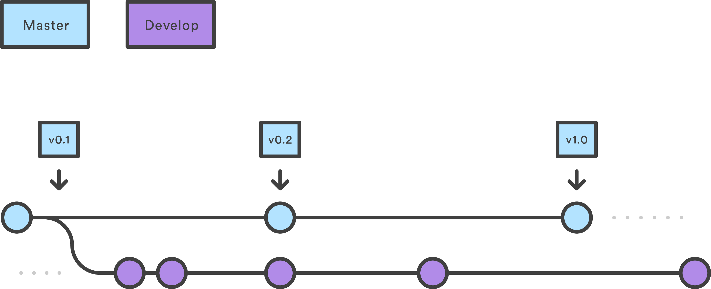
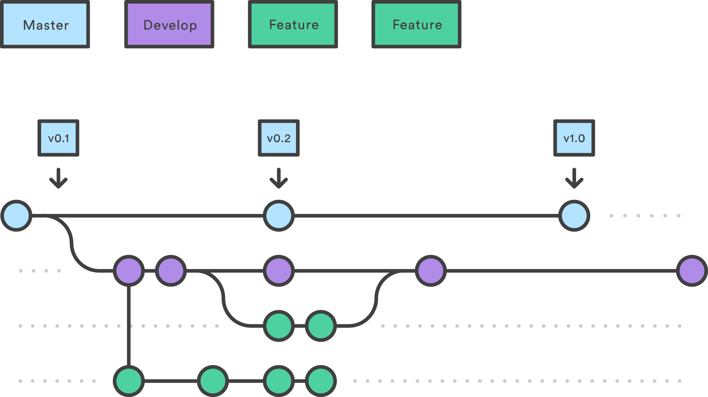
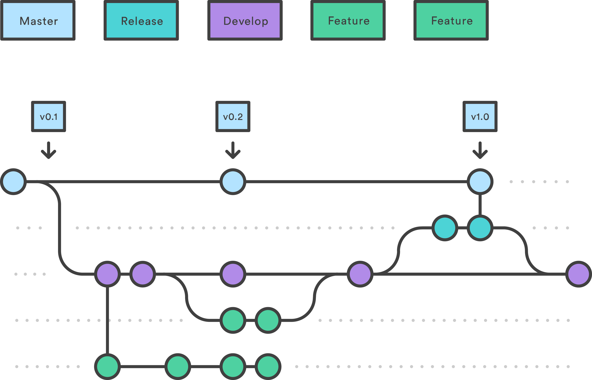
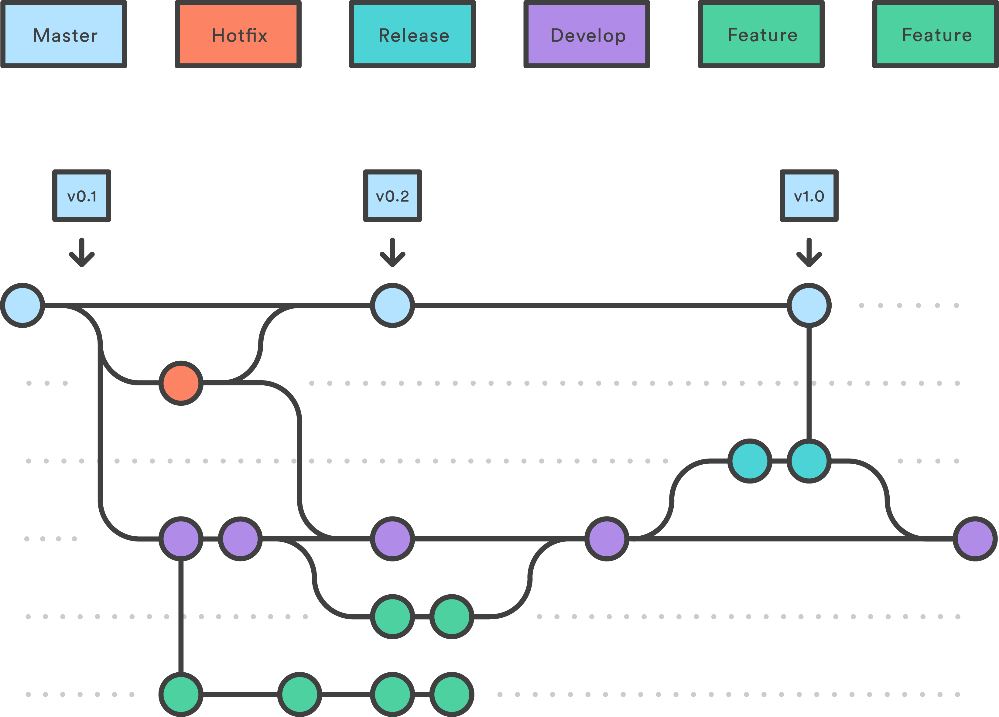

# Git Flow

The Git Flow is important to our process and to ensuring that the code base stays secure and maintained in a way that decreases bad user experience. This process is adapted from the [gitflow-workflow](https://www.atlassian.com/git/tutorials/comparing-workflows/gitflow-workflow).

Review the information below on how to get started with Git in the CM code repositories. 

## Table of Contents
- [Overview](#overview)
    - [Creating feature/release/hotfix/support branches](#creating-featurereleasehotfixsupport-branches)
- [Get Started](#get-started)
    - [How it Works](#how-it-works)
- [Feature Branches](#feature-branches)
    - [List feature branches](#list-feature-branches)
    - [Creating a feature branch](#creating-a-feature-branch)
    - [Publish a feature branch so others can pull/push](#publish-a-feature-branch-so-others-can-pullpush)
    - [Push updates to feature branch](#push-updates-to-feature-branch)
    - [Pull a feature branch/Pull changes on feature branch](#pull-a-feature-branchpull-changes-on-feature-branch)
    - [Finishing a feature branch](#finishing-a-feature-branch)
- [Release Branches](#release-branches)
    - [List release branches](#list-release-branches)
    - [Start a release branch](#start-a-release-branch)
    - [Push release so other devs can work on the branch](#push-release-so-other-devs-can-work-on-the-branch)
    - [Push updates to release](#push-updates-to-release)
    - [Fetch release](#fetch-release)
    - [Pull updates on release](#pull-updates-on-release)
    - [Finish a release branch](#finish-a-release-branch)
- [Hotfix Branches](#hotfix-branches)
    - [List hotfix branches](#list-hotfix-branches)
    - [Start a hotfix branch](#start-a-hotfix-branch)
    - [Push hotfix branch to Github](#push-hotfix-branch-to-github)
    - [Fetch a hotfix branch](#fetch-a-hotfix-branch)
    - [Finish a hotfix branch](#finish-a-hotfix-branch)

<hr>

## Overview
- All Repos Include:
    - `Develop` and `Master` Branches
    - `Feature` Branches
    - `Release` Branches
    - `Hotfix` Branches

- The overall Gitflow is:
    - A `develop` branch is created from `master`
    - A `release` branch is created from `develop`
    - `Feature` branches are created from `develop`
    - When a `feature` is complete it is merged into the `develop` branch
    - When the `release` branch is done it is merged into `develop` and `master`
    - If an issue in `master` is detected a `hotfix` branch is created from `master`
    - Once the `hotfix` is complete it is merged to both `develop` and `master`

### Creating feature/release/hotfix/support branches

* To list/start/finish feature branches, use:
  
  		git flow feature
  		git flow feature start <name> [<base>]
  		git flow feature finish <name>
  
  For feature branches, the `<base>` arg must be a commit on `develop`.

* To push/pull a feature branch to the remote repository, use:

  		git flow feature publish <name>
		git flow feature pull <remote> <name>

* To list/start/finish release branches, use:
  
  		git flow release
  		git flow release start <release> [<base>]
  		git flow release finish <release>
  
  For release branches, the `<base>` arg must be a commit on `develop`.
  
* To list/start/finish hotfix branches, use:
  
  		git flow hotfix
  		git flow hotfix start <release> [<base>]
  		git flow hotfix finish <release>
  
  For hotfix branches, the `<base>` arg must be a commit on `master`.

<hr>

## Get Started

Doing the following will allow you to use git commands to create and merge branches based on our environment. 

Git-flow is a wrapper around Git. The `git flow init` command is an extension of the default `git init` command and doesn't change anything in your repository other than creating branches for you.

- Install `git-flow`
```
brew install git-flow
```
<hr>

### How it Works


Upon setup of your local repo, run the following command to be able to start using git flow:
```
$ git flow init
```
You'll have to answer a few questions regarding the naming conventions for your branches. Use the default values.

When using the git-flow extension library, executing `git flow init` on an existing repo will create the `develop` branch. See Example:

```bash
    $ git flow init
    Initialized empty Git repository in ~/project/.git/
    No branches exist yet. Base branches must be created now.
    Branch name for production releases: [master]
    Branch name for "next release" development: [develop]

    How to name your supporting branch prefixes?
    Feature branches? [feature/]
    Release branches? [release/]
    Hotfix branches? [hotfix/]
    Support branches? [support/]
    Version tag prefix? []

    $ git branch
    * develop
    master
```
<hr>

## Feature Branches
Instead of branching off of `master`, `feature` branches use `develop` as their parent branch. When a feature is complete, it gets merged back into develop. Features should never interact directly with `master`.



### List feature branches
Run in the command line:
```
$ git flow feature
```

### Creating a feature branch
Run in the command line:
```
$ git checkout develop
$ git pull origin develop
$ git flow feature start <name>
```
Continue your work and use Git like you normally would.

### Publish a feature branch so others can pull/push
Run in the command line:

```
$ git status
$ git add -A
$ git commit -am "Your message"
$ git flow feature publish <name>
```

### Push updates to feature branch
Run in the commande line:
```
$ git status
$ git add .
$ git commit -am "Your message"
$ git pull origin develop
$ git push origin feature/<name>
```

### Pull a feature branch/Pull changes on feature branch
If you want to pull updates to a feature from GitHub, do the following git-flow.

Run in the command line:

```
$ git flow feature pull origin <name>
```

### Finishing a feature branch
```
$ git status
$ git add .
$ git commit -am "Your message"
$ git pull origin develop
$ git push origin feature/<name>
```

- Create a PR for the feature against the `develop` branch.
- Once approved, merge into `develop`
- Delete the feature branch from Github

Go back to command line and run:
```
$ git checkout develop
$ git pull origin develop
$ git branch -D feature/<name>
```

<!-- Run in the command line:

```
git flow feature finish <name>
``` -->

<hr>

## Release Branches

**NOTE:** The `development` branch will likely always be ahead of `master`. This is because the `master` branch is the stable production build while the `development` branch is for ongoing development and features, which may not have been released yet.

Once `develop` has acquired enough features for a release (or a predetermined release date is approaching), you fork a `release` branch off of `develop`. Creating this branch starts the next release cycle, so no new features can be added after this point—only bug fixes, documentation generation, and other release-oriented tasks should go in this branch. Once it's ready to ship, the `release` branch gets merged into `master` and tagged with a version number. In addition, it should be merged back into `develop`, which may have progressed since the release was initiated.

Using a dedicated branch to prepare releases makes it possible for one team to polish the current release while another team continues working on features for the next release. It also creates well-defined phases of development (e.g., it's easy to say, “This week we're preparing for version 4.0,” and to actually see it in the structure of the repository).

Making `release` branches is another straightforward branching operation. Like `feature` branches, `release` branches are based on the `develop` branch. A new `release` branch can be created using the following methods.



### List release branches
Run the following in the command line:
```
$ git flow release 
```

### Start a release branch
Run the following in the command line:
```
$ git checkout develop
$ git pull origin develop
$ git flow release start <release.number>
# Switched to a new branch 'release/<release.number>'
```

### Push release so other devs can work on the branch
```
$ git status
$ git add .
$ git commit -m "Your message"
$ git flow release publish <release.number>
```

### Push updates to release
```
$ git status
$ git add .
$ git commit -am "Your message"
$ git push origin release/<release.number>
```

### Fetch release
```
$ git fetch origin release/<release.number>
$ git branch –no-track release/<release.number> FETCH_HEAD
$ git checkout release/<release.number>
```

### Pull updates on release
```
$ git pull origin release/<release.number>
```

Once the release is ready to ship, it will get merged it into both `master` and `develop`, then the `release` branch will be deleted. It’s important to merge back into `develop` because critical updates may have been added to the `release` branch and they need to be accessible to new features. 

### Finish a release branch
```
$ git status
$ git add .
$ git commit -am "Your message"
$ git push origin release/<release.number>
```

- Create a PR for the release against the `master` branch.
- Once approved, merge into `master`
- Delete the feature branch from Github

Go back to command line and run:
```
$ git tag -a <release.number> -m "tag_message" #no spaces
$ git flow release finish <release.number>
$ git checkout develop
$ git pull origin develop
$ git push origin develop
```

<hr>

## Hotfix Branches


Maintenance or `“hotfix”` branches are used to quickly patch production releases. `Hotfix` branches are a lot like release branches and `feature` branches except they're based on `master` instead of `develop`. This is the only branch that should fork directly off of `master`. As soon as the fix is complete, it should be merged into both `master` and `develop` (or the current release branch), and `master` should be tagged with an updated version number.

Having a dedicated line of development for bug fixes lets your team address issues without interrupting the rest of the workflow or waiting for the next release cycle. You can think of maintenance branches as ad hoc `release` branches that work directly with `master`. A `hotfix` branch can be created using the following command:

### List hotfix branches
Run the following in the command line:
```
$ git flow hotfix 
```

### Start a hotfix branch
Run the following in the command line:
```
$ git checkout master
$ git pull origin master
$ git flow hotfix start hotfix_branch
```

### Push hotfix branch to Github
```
git push origin hotfix/hotfix_branch
```

### Fetch a hotfix branch
```
$ git fetch origin hotfix/<name>
```

Similar to finishing a `release` branch, a `hotfix` branch gets merged into both `master` and `develop`.

### Finish a hotfix branch
```
$ git status
$ git add .
$ git commit -am "Your message"
$ git pull origin master
$ git flow hotfix finish hotfix_branch
$ git push origin master
$ git checkout develop
$ git pull origin develop
$ git push origin develop
```

